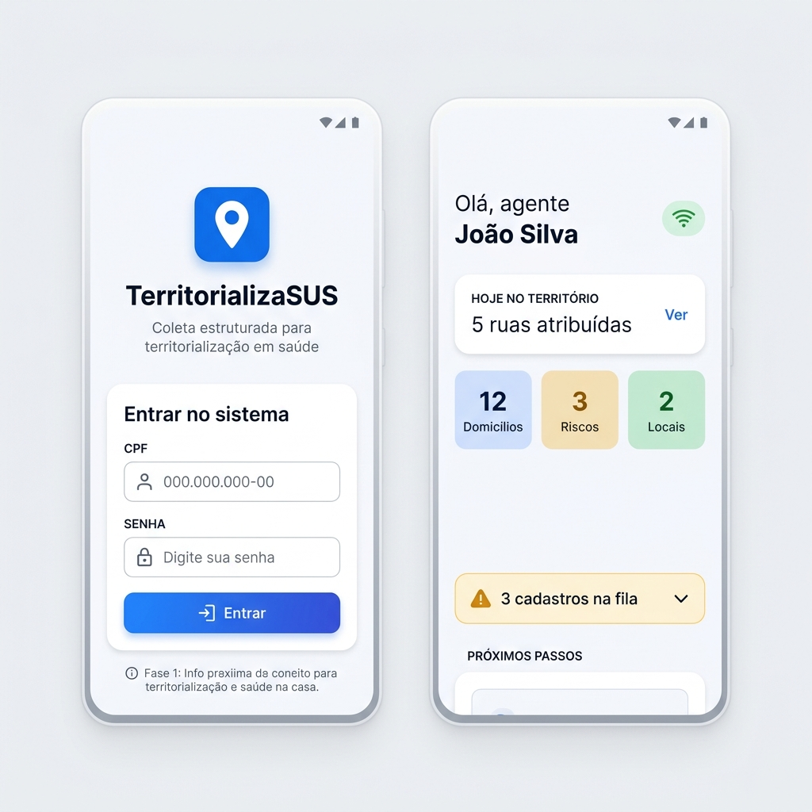
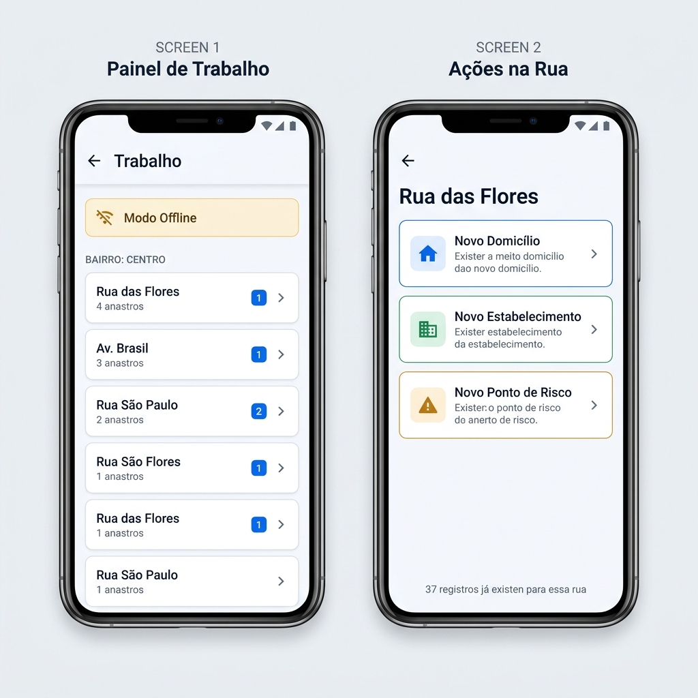
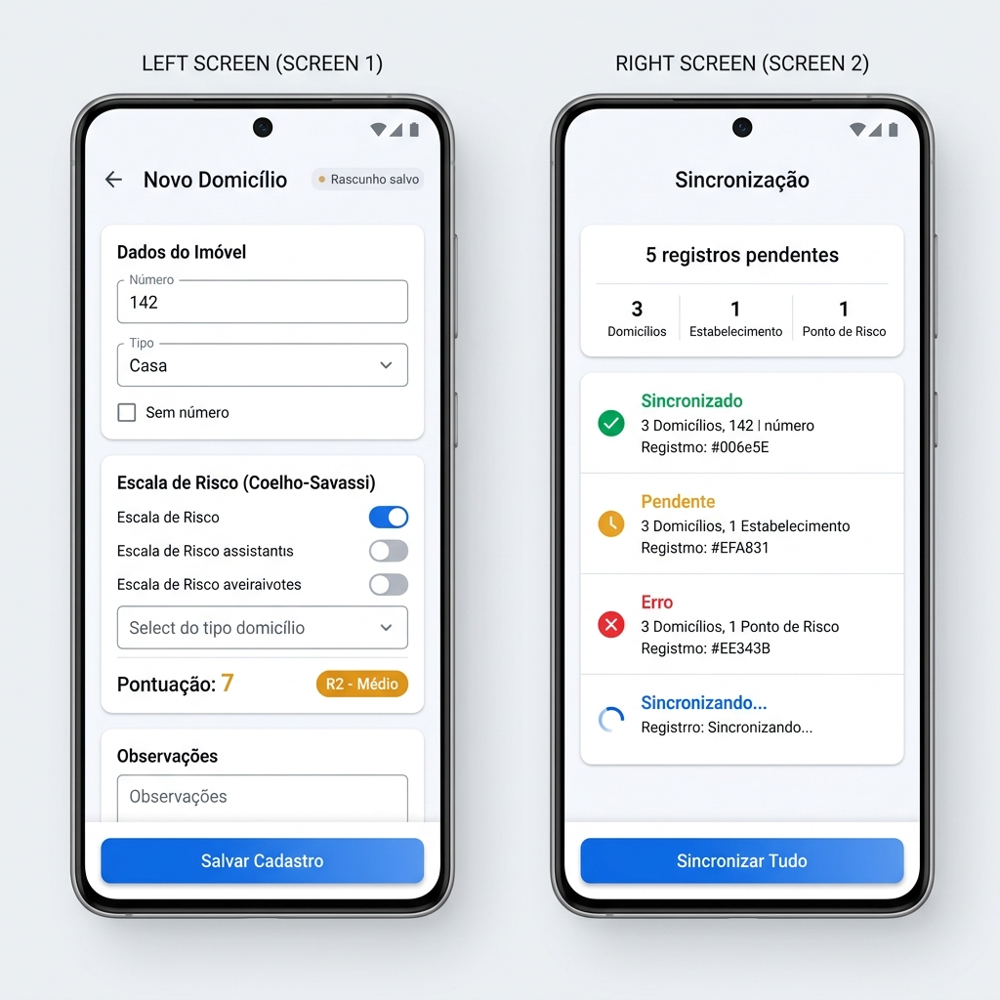
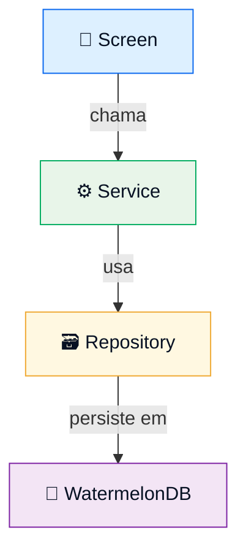

<p align="center">
  
</p>

<h1 align="center">🏥 TerritorializaSUS</h1>

<p align="center">
  <strong>Coleta estruturada de dados em campo para territorialização em saúde</strong>
</p>

<p align="center">
  
  
  
  
  
  
  
</p>

---

## 📱 Sobre o Projeto

A **territorialização em saúde** é o processo pelo qual equipes da Estratégia Saúde da Família (ESF) mapeiam o território sob sua responsabilidade — identificando domicílios, estabelecimentos, pontos de risco, condições de vida e vulnerabilidades da população. É a base para o planejamento das ações de saúde no SUS.

O **TerritorializaSUS** é uma **solução tecnológica completa** para apoiar esse processo, composta por dois componentes principais:

| Componente | Descrição | Público-alvo |
|---|---|---|
| 📲 **Aplicativo Móvel** *(este repositório)* | Coleta de dados em campo com abordagem **offline-first**. Permite cadastrar domicílios, estabelecimentos e pontos de risco, aplicar a Escala de Risco Familiar de Coelho-Savassi e sincronizar os dados posteriormente. | Agentes Comunitários de Saúde (ACS) e equipes da ESF |
| 🖥️ **Sistema Web** *(em desenvolvimento futuro)* | Painel de administração para acompanhamento do processo de territorialização, resolução de conflitos de sincronização, visualização de mapas, dashboards e relatórios. | Gestores, analistas e coordenadores da Atenção Básica |

```
┌─────────────────────┐          ┌─────────────────────┐
│   📲 App Móvel      │          │   🖥️ Sistema Web    │
│   (Campo/Offline)   │          │   (Gestão/Online)   │
│                     │          │                     │
│  • Coleta de dados  │          │  • Dashboards       │
│  • Escala Savassi   │──────────│  • Mapas            │
│  • Fila de sync     │  API /   │  • Relatórios       │
│  • GPS              │  Backend │  • Conflitos sync   │
└─────────────────────┘          └─────────────────────┘
                         ↕
              ┌────────────────────┐
              │  🗄️ Banco Central  │
              │  (Servidor)        │
              └────────────────────┘
```

---

## ✨ Funcionalidades do MVP

- 🔐 **Autenticação** — Login por CPF com sessão local
- 📡 **Sincronização inicial** — Download de bairros, ruas e atribuições
- 📴 **Modo offline completo** — Todas as coletas funcionam sem internet
- 🏠 **Cadastro de domicílios** — Dados do imóvel + localização GPS
- 📊 **Escala de Risco Coelho-Savassi** — Cálculo automático de pontuação e classificação
- 🏢 **Cadastro de estabelecimentos** — Comércios e serviços de interesse
- ⚠️ **Cadastro de pontos de risco** — Áreas de vulnerabilidade ou perigo
- 💾 **Salvamento automático de rascunhos** — Nunca perca dados no campo
- 🔄 **Fila de sincronização** — Controle visual do status de cada registro
- 📍 **Captura de GPS** — Com fallback gracioso (falha de GPS não bloqueia o cadastro)

---

## 📸 Telas do Aplicativo

<p align="center">
  
</p>
<p align="center"><em>Login com CPF e Tela Inicial com estatísticas do território</em></p>

<p align="center">
  
</p>
<p align="center"><em>Painel de trabalho offline e ações disponíveis na rua selecionada</em></p>

<p align="center">
  
</p>
<p align="center"><em>Cadastro de domicílio com Escala Coelho-Savassi e tela de sincronização</em></p>

---

## 🏗️ Arquitetura

A arquitetura interna do app segue uma separação por camadas de responsabilidade. Essa escolha foi feita por **separar claramente as responsabilidades** de cada camada, o que garante **maior manutenibilidade do código** à medida que o projeto evolui — facilitando testes, refatorações e a substituição de implementações (como trocar a sincronização mockada por uma API real).



| Camada | Responsabilidade |
|---|---|
| **Screen** | Interface visual, interação do usuário, formulários |
| **Service** | Regras de negócio, validações, cálculos (ex: Escala Savassi) |
| **Repository** | Leitura e escrita de dados no banco local |
| **WatermelonDB** | Persistência local offline com suporte a observáveis |

> **Regras:** Screen não acessa o banco diretamente. Service não renderiza UI. Repository não contém regras de negócio.

---

## 🛠️ Stack Tecnológica

| Tecnologia | Papel |
|---|---|
| [Expo](https://expo.dev/) (SDK 57) | Plataforma de desenvolvimento |
| [React Native](https://reactnative.dev/) 0.86 | Framework mobile |
| [TypeScript](https://www.typescriptlang.org/) | Tipagem estática |
| [Expo Router](https://docs.expo.dev/router/introduction/) | Navegação baseada em arquivos |
| [WatermelonDB](https://watermelondb.dev/) | Banco de dados local offline-first |
| [React Hook Form](https://react-hook-form.com/) + [Zod](https://zod.dev/) | Formulários e validação |
| [Expo Location](https://docs.expo.dev/versions/latest/sdk/location/) | Captura de GPS |
| [Lucide React Native](https://lucide.dev/) | Ícones |
| Context API + Hooks | Gerenciamento de estado |

---

## 🚀 Como Executar

### Pré-requisitos

- [Node.js](https://nodejs.org/) 18+
- [Android Studio](https://developer.android.com/studio) com SDK e emulador configurados
- [Java JDK 17](https://adoptium.net/)

> ⚠️ O projeto usa **Expo Development Build** (não Expo Go), pois o WatermelonDB requer integração nativa.

### Instalação

```bash
# Clone o repositório
git clone https://github.com/ryanribeiroz/tr-sus.git
cd tr-sus/territorializasus

# Instale as dependências
npm install

# Gere o build nativo Android
npx expo run:android
```

### Credenciais de Teste (Fase 1)

A autenticação na Fase 1 é provisória. Use qualquer CPF com 11 dígitos:

```
CPF: 12345678901
Senha: qualquer valor
```

---

## 📍 Roadmap

| Fase | Descrição | Status |
|---|---|---|
| **Fase 1** | Infraestrutura do app + banco local + telas do MVP | ✅ Concluída |
| **Fase 2** | Backend / API | ⏳ Planejada |
| **Fase 3** | Sincronização real | ⏳ Planejada |
| **Fase 4** | Sistema web para gestores | ⏳ Planejada |
| **Fase 5** | Mapas, relatórios e exportações | ⏳ Planejada |

---

## 📄 Licença

Este projeto está licenciado sob a **GNU General Public License v3.0** — veja o arquivo [LICENSE](territorializasus/LICENSE) para detalhes.

---

## 👥 Autores

- **Ryan Ribeiro** — [@ryanribeiroz](https://github.com/ryanribeiroz)

---

<details>
<summary>🌐 English Summary</summary>

## TerritorializaSUS

**TerritorializaSUS** is a complete technological solution to support **health territorialization** — the process by which Family Health Strategy (ESF) teams in Brazil's public health system (SUS) map their territories, identifying households, establishments, risk points, and population vulnerabilities.

### The Solution

The solution consists of two main components:

- **📲 Mobile App** *(this repository)*: Offline-first field data collection tool for Community Health Agents (ACS). Supports household registration, risk assessment using the Coelho-Savassi Family Risk Scale, GPS capture, and sync queue management.
- **🖥️ Web System** *(future development)*: Administration panel for managers to monitor the territorialization process, resolve sync conflicts, view maps, dashboards, and reports.

### Key Features (MVP)

- CPF-based authentication with local sessions
- Full offline mode — all data collection works without internet
- Household, establishment, and risk point registration
- Automatic Coelho-Savassi Risk Scale scoring
- Auto-save drafts to prevent field data loss
- Visual sync queue with status tracking per record
- GPS capture with graceful fallback

### Tech Stack

Expo (SDK 57) · React Native 0.86 · TypeScript · WatermelonDB · Expo Router · React Hook Form · Zod

### Quick Start

```bash
git clone https://github.com/ryanribeiroz/tr-sus.git
cd tr-sus/territorializasus
npm install
npx expo run:android
```

### License

GPLv3 — See [LICENSE](territorializasus/LICENSE) for details.

</details>
